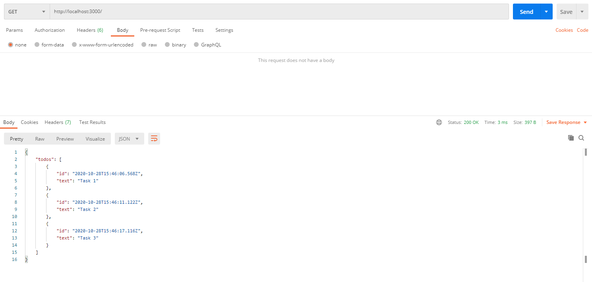
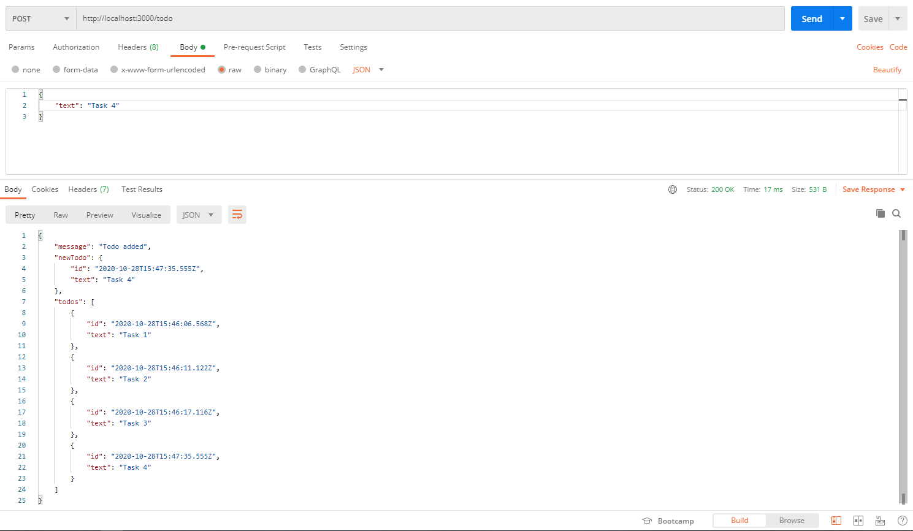
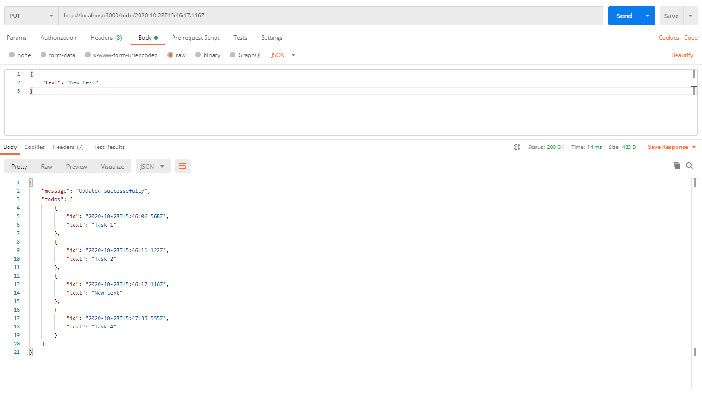
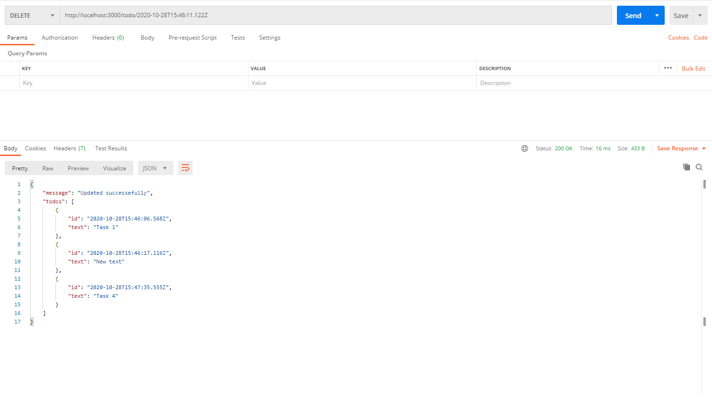

## Simple TODO made with Node and TS

A conventional TODO made with Node and TypeScript, this was my introduction to TypeScript, a Hello World of sorts.






### Table of contents

| Request    | Type     | Required Fields                                       | Description         |
| ---------- | -------- | ----------------------------------------------------- | ------------------  |
| Todos      | GET      | null                                                  | Gets all todos.     |
| Todo       | PUT      | text: string                                          | Overwrite todo text.|
| Todo       | POST     | text: string                                          | Creates todo.       |
| Todo       | DELETE   | id: query string                                      | Deletes todo.       |

## Installation

_Make sure to have [Git](http://git-scm.com/) and [Node.js](http://nodejs.org/) 10.0.0 (or higher) installed._

1. Clone it or fork it.

2. Once you have your local copy, install its dependencies using either Yarn:

```
yarn
```

or npm:

```
npm install
```

or pnpm:

```
pnpm install
```

## Running

After installed, you can start the application by running it with Yarn/pnpm:

```
yarn/pnpm start
```

or npm:

```
npm run start
```

## Meta

Gustavo Máximo – gmaximo.dev
